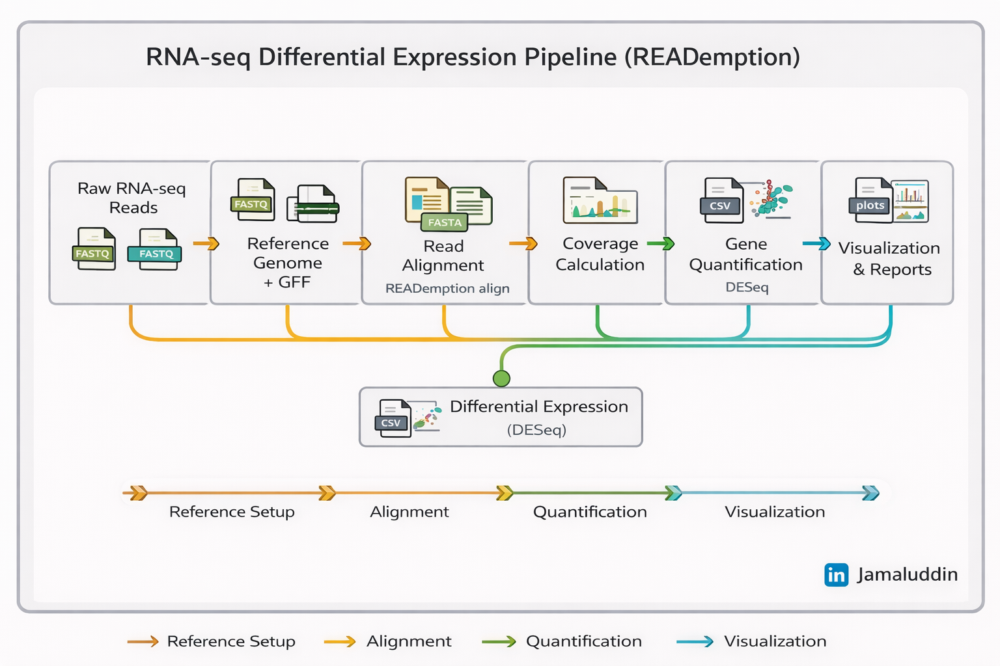

### RNA-seq Differential Expression Pipeline (READemption)
---
A reproducible RNA-seq workflow for bacterial transcriptomics using READemption
---


### Overview
This repository provides an automated end-to-end RNA-seq analysis pipeline for bacterial transcriptomics using READemption.
It is demonstrated on Salmonella enterica serovar Typhimurium using the public READemption tutorial dataset.

# Pipeline Workflow:


---

### Requirements  
* Conda environment with required packages, see bash 'installation.sh' script

### Repository Structure
```
rnaseq-reademption-pipeline/
├── installation.sh          # Conda environment and tool installation
├── analysis.sh              # Automated RNA-seq workflow
├── READemption_analysis/    # Auto-generated analysis directory
│   ├── input/
│   │   ├── reads/                          # Raw FASTQ files
│   │   ├── salmonella_reference_sequences  # Reference FASTA
│   │   └── salmonella_annotations/         # Genome annotation (GFF/GTF)
│   ├── output/
│   │   ├── align/        # Alignment files
│   │   ├── coverage/     # Coverage tracks
│   │   ├── gene_quanti/  # Gene-level quantification
│   │   ├── deseq/        # Differential expression results
│   │   └── viz/          # Plots and figures
└── README.md
```
---
### Quick Start
# 1. Install all dependencies (one-time)
```
bash installation.sh
```
This script:
* Creates a dedicated Conda environment
* Installs READemption and all required dependencies
  
# 2. Run the RNA-seq analysis
```
bash analysis.sh
```
This script:
* Assumes raw reads and reference files are placed inADemption_analysis/input/
* Executes the full READemption-based workflow from alignment to differential expression and visualization
---
### Key Outputs


| SN | Output                  | Location              |
|----| ----------------------- | --------------------- |
| 1  | Alignment files         | `output/align/`       |
| 2  | Coverage tracks         | `output/coverage/`    |
| 3  | Gene counts             | `output/gene_quanti/` |
| 4  | Differential expression | `output/deseq/`       |
| 5  | Plots & figures         | `output/viz/`         |

---
### Applications

* Bacterial transcriptomics
* Differential gene expression
* Stress / condition response studies
---

# Acknowledgement
[Dr.Aammar](https://github.com/AammarTufail)

